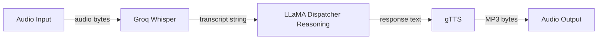

# DispatchOS

## What This Is
DispatchOS is a headless voice agent designed to automate the initial handling of inbound driver calls in freight logistics. It simulates a carrier dispatcher by transcribing driver voice check-ins, reasoning about the intent (e.g., status updates, breakdown reporting, or lumper requests), and generating a contextually appropriate vocal response. The system uses gTTS as a free placeholder for speech synthesis, while a production implementation would utilize ElevenLabs for low-latency streaming or a real-time layer like LiveKit to eliminate the file-processing overhead.

## Architecture


## Endpoints
| Endpoint | Method | Input | Output | Purpose |
| :--- | :--- | :--- | :--- | :--- |
| `/api/v1/health` | GET | None | JSON | Health check & dependency status |
| `/api/v1/transcribe` | POST | Audio File | JSON | Speech-to-text via Groq Whisper |
| `/api/v1/reason` | POST | JSON (transcript) | JSON | LLM dispatcher response generation |
| `/api/v1/synthesize` | POST | JSON (text) | Audio (MP3) | Text-to-speech via gTTS |
| `/api/v1/dispatch-call` | POST | Audio File | Audio (MP3) | Full end-to-end voice agent pipeline |
| `/api/v1/apidocs` | GET | None | HTML | Custom static documentation page |

## Documentation
- **Interactive API Docs**: Available at `/docs` (Swagger UI) with full schema definitions and metadata.
- **Static Documentation**: Available at `/api/v1/apidocs` for a high-performance, dependency-free overview of all routes and the pipeline architecture.

## Running Locally
1. **Setup Environment**:
   Ensure you have Python 3.11 installed.
   ```bash
   python -m venv venv
   source venv/bin/activate  # On Windows: venv\Scripts\activate
   pip install -r requirements.txt
   ```

2. **Configuration**:
   Create a `.env` file in the root directory:
   ```env
   GROQ_API_KEY=your_groq_api_key_here
   ```

3. **Start Server**:
   ```bash
   uvicorn app.main:app --host 0.0.0.0 --port 8000
   ```

4. **Test Pipeline**:
   Test the full `/dispatch-call` endpoint with an audio file:
   ```bash
   curl -X POST http://localhost:8000/api/v1/dispatch-call \
     -F "file=@test_audio.wav" \
     --output response.mp3
   ```

## Deployment
### Railway.app
This project is pre-configured for deployment on [Railway](https://railway.app/).
- The `railway.toml` file handles the build and deployment settings.
- Ensure the `GROQ_API_KEY` is set in your Railway project environment variables.

### Docker
To run the containerized version locally:
```bash
docker build -t dispatch-os .
docker run -p 8080:8080 -e GROQ_API_KEY=your_key dispatch-os
```

## TTS Note
gTTS is used here as a zero-cost placeholder. In production, this would be replaced with ElevenLabs (eleven_turbo_v2 for low latency) or integrated directly into a LiveKit session for real-time bidirectional audio — which is likely closer to how Hemut's Reach product handles voice at scale.

## What's Missing (Honest Next Steps)
- Real-time streaming with LiveKit instead of file upload
- ElevenLabs or Deepgram TTS for production voice quality and latency
- Async job queue (Celery/Redis) for concurrent calls
- Load context injection (actual TMS data fed into reasoning prompt)
- Speaker diarization for multi-party calls
- End-to-end latency target: under 800ms for production voice response